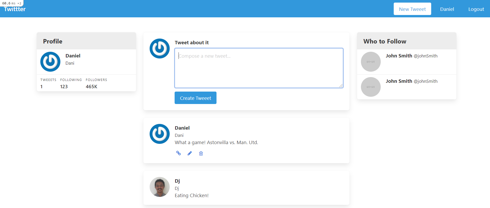

# Twittter - a clone of Tweeter 
> This project is a clone of Tweeter that is created to practice authentication using devise

## Built With
- Ruby On Rails
- Devise
- Simple Forms

## Requirements
- The software should enable registration, log in and logout
- Tweets should allow edit and delete operations only for authorized users

## Getting Started
- Clone the project in to your computer using `git clone https://github.com/DejazmachMolla/Twittter.git`
- `cd` into the `Twitter` folder
- Install dependencies by running `bundle install`
- Run the project using the command `rails s`

## Authors

:bust_in_silhouette: **Dejazmach Molla**

- Github: [@DejazmachMolla](https://github.com/DejazmachMolla)
- Twitter: [@DJATSS](https://twitter.com/DJATSS)
- Linkedin: [Dejazmach Molla](https://www.linkedin.com/in/dejazmach-getachew-027aabaa/)

## Show your support

Give a ⭐️ if you like this project!

## Acknowledgments

- Microverse